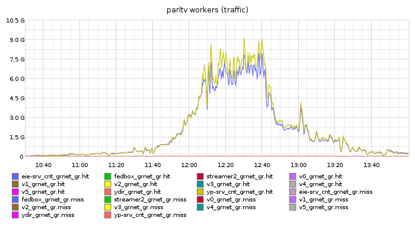
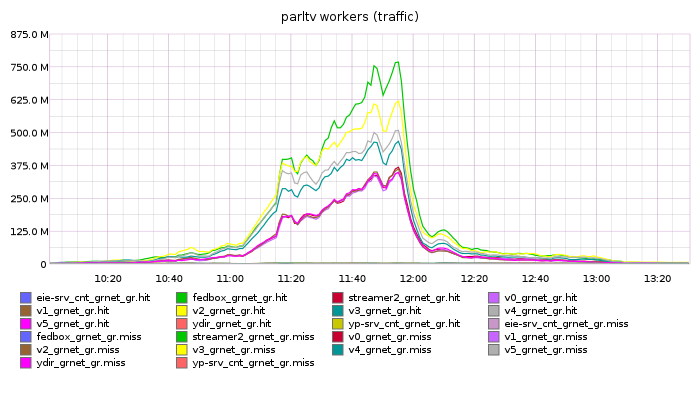
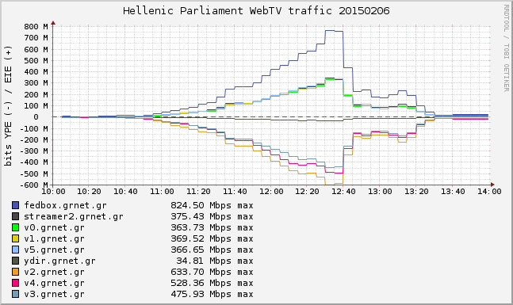

# Hellenic Parliament WebTV traffic bursts

1. [2012-10-30](#2012-10-30)
1. [2012-11-07](#2012-11-07)
1. [2012-11-10](#2012-11-10)
1. [2013-01-17](#2013-01-17)
1. [2013-06-12](#2013-06-12)
1. [2013-07-15 -- 2013-07-19](#2013-07-15----2013-07-19)
1. [2013-11-08 -- 2013-11-10](#2013-11-08----2013-11-10)
1. [2014-03-29 -- 2014-03-31](#2014-03-29----2014-03-31)
1. [2014-05-07](#2014-05-07)
1. [2014-05-15](#2014-05-15)
1. [2014-06-04](#2014-06-04)
1. [2014-10-08 -- 2014-10-10](#2014-10-08----2014-10-10)
1. [2014-11-14](#2014-11-14)
1. [2014-12-07](#2014-12-07)
1. [2014-12-10](#2014-12-10)
1. [2014-12-17](#2014-12-17)
1. [2014-12-23](#2014-12-23)
1. [2014-12-29](#2014-12-29)
1. [2015-02-05](#2015-02-05)
1. [2015-02-06](#2015-02-06)

## 2012-10-30
* max 1K streams, 550 Mbps
* total 36K streams, 360 GB

## 2012-11-07
* max 4342 streams, 1.66 Gbps
* total 212K streams, 4740 GB, 37K client IPs
* web 171K page views, 89K visitors

## 2012-11-11
* max 1 Gbps
* total 1726 GB, 8200 client IPs
* web 26K page views, 18K visitors

## 2013-01-17
* max 1.79 Gbps
* total 80K streams, 34K client IPs, 7072 GB
* web 103K page views, 69.5K visitors

## 2013-06-12
* max 1.75 Gbps

## 2013-07-15 -- 2013-07-19
* max 1.54 Gbps

## 2013-11-08 -- 2013-11-10
* max 3.55 Gbps, approx. 6400 streams

## 2014-03-29 -- 2014-03-31
* max 4.72 Gbps, approx. 7400@640K or 3700@1280K streams
* total 99 GB streaming over HTTPS
* total 44.5K RTMP streams
* web 490K page views, 136K visitors, 5400 referrers

## 2014-05-07
* max 2.87 Gbps, approx. 4500@640K or 2250@1280K streams
* web 55K page views, 20K visitors, 450 referrers

## 2014-05-15
* max 1.5 Gbps, approx. 2350@640K or 1180@1280K streams
* web 10600 page views, 5200 visitors, 500 referrers

## 2014-06-04
* max 5 Gbps, approx. 7850@640K or 3930@1280K streams
* web 210K page views, 69K visitors, 800 referrers

## 2014-10-08 -- 2014-10-10
* max 4.5 Gbps, approx. 7070@640K or 3530@1280K streams
* web
 * 2014-10-08: 66Κ page views, 22.4K visitors, 1170 referrers
 * 2014-10-09: 110K page views, 35K visitors, 1490 referrers
 * 2014-10-10: 247K page views, 65Κ visitors, 2090 referrers

## 2014-11-14
* max 1.76 Gbps, approx. 2750@640K or 1370@1280K streams

## 2014-12-07
* max 6.03 Gbps, approx. 9430@640K or 4715@1280K streams
* web 280K page views, 63.2K visitors, 1500 referrers

## 2014-12-10
* max 3.2 Gbps, approx. 5031@640K or 2515@1280K streams
* web 118K page views, 40K visitors, 1300 referrers

## 2014-12-17
* max 5.8 Gbps, approx. 9060@640K or 4530@1280K streams
* web 350K page views, 78.35K visitors, 2360 referrers

## 2014-12-23
* max 9.45 Gbps, approx. 14770@640K or 7385@1280K streams
* web 328K page views, 65.5K visitors, 1670 referrers

### HTTP traffic

## 2014-12-29
* max 15.65 Gbps, approx. 16200 streams
* web 600K page views, 100K visitors, 1600 referrers

### HTTP traffic

### GR-IX traffic
#####GRNET

#####Aggregate

## 2015-02-05
* max 4 Gbps, approx. 6300@640K or 3155@1280K streams
* web 185K page views, 33K visitors, 1300 referrers

### HTTP traffic

## 2015-02-06
* max 3.9 Gbps, approx. 6090@640K or 3045@1280K streams
* web 175K page views, 40K visitors, 1150 referrers

### HTTP traffic

